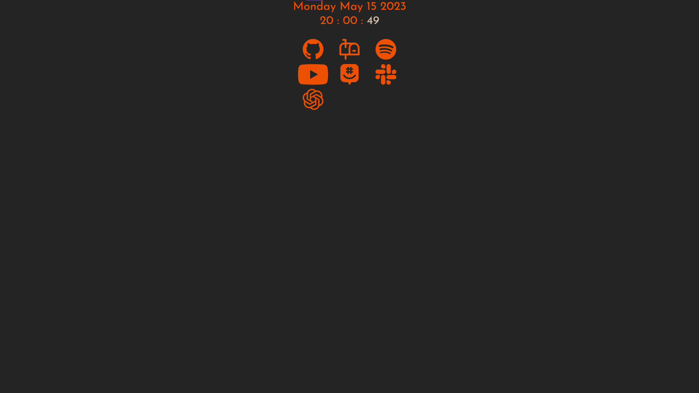

# Seakeal's Startpage

This is what my page looks like.

TODO LIST:
- api/rss.php
	- Pull RSS sources from the database
	- Add TF2 website RSS feed
	- Add Terry Cavanagh's blog RSS feed
	- Add Worthikids YouTube RSS feed
	- Mess with this → create an issue or something
	- Run each feed in parallel and sort the completed array
- mod/bookmarks.php
	- Add buttons that lead to other pages in site
	- Add button that updates the TODO list (hide in production)
- pages/archive.php
	- Implement a better random query https://mariadb.com/kb/en/data-sampling-techniques-for-efficiently-finding-a-random-row/
	- Uncomment, only commented out for offline testing
	- Implement check for image vs video
	- Get meme ID from URL and add a landing page
- src/background.js
	- Make a module for the scrolling gradient background
	- This may be a memory leak, try without redeclaring
- src/contentBox.js
	- Think about moving this to style.css
	- Figure out a good way to open and close the box
- src/rss.js
	- Comment out console log
	- Make modal for description
- styles/simple.css
	- Make RSS box size dynamically like other UI elements
